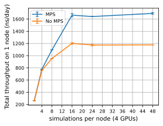

====================
Performance Cookbook
====================

The performance cookbook part of the GROMACS best practice guide
assumes your simulations are prepared appropriately and provides
concrete guidance on how best to run GROMACS simulations, i.e. execute
``mdrun``, so as to make good use of available hardware and obtain
results in the shortest time possible, be it on a laptop, a multi-GPU
desktop workstation, a departmental cluster, and especially on large
supercomputers. This complements and provides a bridge into navigating
the detailed information provided in the "getting good performance
from mdrun" page in the GROMACS manual:

http://manual.gromacs.org/current/user-guide/mdrun-performance.html

GROMACS can generally be launched without specifying anything other
than the essential simulation parameters, as it has built-in
heuristics that enable it to detect the underlying hardware and use
accumulated insights about good performance embedded in the code to
make usually reasonable choices given the available number and types
of CPU cores and/or GPUs. By default GROMACS also adapts dynamically
during execution to improve performance. However for any given
simulation it is possible that better than default choices
exist. Understanding how to control these by explicitly specifying
parallel execution options and how best to approach obtaining optimal
use of available hardware can make a significant difference to
throughput and hence scientific results achieved over a given
timespan, as well as to financial (cost) and environmental (energy
usage) efficiency. For using high-performance computing resources
there is additionally clear value in knowing what scale of resources
(number of cores / nodes / GPUs) are efficient to use, or how to go
about finding this out. 

As well as general guidance applicable to whatever machine you may be
running GROMACS on, the performance cookbook provides concrete
examples showing how to obtain good performance on a number of
specific PRACE and EuroHPC machines, both as an
illustration of the application of general best practice process for
obtaining good performance, and to promote efficient usage of the
named machines. The cookbook also provides a reference set of (near)
optimal benchmark performance results obtained on these machines using
best practice in order to aid estimation of required compute time
allocations for researchers requesting such time. 


-------------------------------------------------------------------------------
General guidance on running ``mdrun`` and strategy for getting good performance
-------------------------------------------------------------------------------

Single node
-----------

When using GROMACS on a single node, that is to say a machine such as
a laptop, desktop workstation, or server, where all processor cores or
GPUs have access to a single shared memory, we typically run the
thread-mpi version of mdrun (``gmx mdrun``).

**CPU only**

Running GROMACS with the default of one thread-mpi rank per core on a
single-node CPU-only machine is often optimal, however one can
experiment with different combinations of numbers of thread-MPI ranks
(controlled by varying ``-ntmpi N``) and numbers of OpenMP threads per
rank (controlled by varying ``-ntomp M`` and setting the environment
variable ``OMP_NUM_THREADS=M``), such that ``M x N`` is equal to the
total number of CPU cores available on the node. Many processors
support simultaneous multithreading (SMT), known as hyperthreading on
Intel processors, whereby each physical core can efficiently execute
multiple threads or processes. Enabling multithreading may boost
performance. To make use of SMT, ``-ntmpi N`` and ``-ntomp M`` should
be chosen such that ``M x N`` equals the number of logical cores
identified by the operating systems, which is equal to the number of
physical processor cores multiplied by the number of simultaneous
multithreads supported by each physical core.

If executing on more than at least 12 ranks GROMACS by default
dedicates a certain fraction of the ranks to PME calculations.  The
number of PME ranks is based on various heuristics that reflect what
the developers expect to be optimal based on the underlying algorithms
and what has often been found to give good performance. During
execution GROMACS attempts to reduce the load imbalance between PP and
PME ranks, unless this functionality is disabled by choosing
``-tunepme no``.  Even when enabled however, this dynamic PME tuning
does not change the number of PME ranks from what GROMACS decides
according to its built-in heuristics. It is possible to explicitly
specify the number of PME ranks to use with the ``-npme`` option. You
should examine the md.log file produced and check if there is any
warning suggesting to try use a larger or smaller number of PME ranks
for your simulation. A more systematic way to determine a
performance-optimal number of PME ranks for a given total number of
ranks can be determined using the ``gmx tune_pme`` tool as described
in `gmx tune_pme
<http://manual.gromacs.org/current/onlinehelp/gmx-tune_pme.html#gmx-tune-pme>`_

For details, see `Running mdrun within a single node
<http://manual.gromacs.org/current/user-guide/mdrun-performance.html#running-mdrun-within-a-single-node>`_
and `Process(-or) level parallelization via OpenMP <http://manual.gromacs.org/current/user-guide/mdrun-performance.html#process-or-level-parallelization-via-openmp>`_


**CPU + GPU**

By default GROMACS launches one thread-mpi rank per GPU. It is worth
experimenting running with more thread-mpi ranks, up to one rank per
CPU core. Whatever the number of ranks, choose ``-ntomp`` to ensure
all available CPU cores are used, and apply similar considerations to
adjust ``-ntomp`` for hyperthreading/SMT-capable processors as
described above for CPU-only execution. 
    
**GPU offload options**

By default GROMACS offloads short-range non-bonded force calculations
(``-nb gpu``), PME calculations (``-pme gpu``) and, on NVIDIA GPUs,
bonded force calculations (``-bonded gpu``).  For GROMACS 2022
PME offload to GPU can only be done by a single rank (i.e. a single
GPU). PME offload is also subject to a number of further `known
limitations
<http://manual.gromacs.org/current/user-guide/mdrun-performance.html#known-limitations>`_.

It is worth experimenting with offload options taking into account the
`performance considerations for GPU tasks
<http://manual.gromacs.org/current/user-guide/mdrun-performance.html#performance-considerations-for-gpu-tasks>`_
and considering your hardware, in particular the number and respective
age and computational power of your processor(s) and your GPU(s). For
example, FFTs are offloaded by default if PME is offloaded (which also
happens by default), but this can be avoided with ``-pmefft cpu`` and
may be beneficial for an older GPU sitting alongside newer CPU.

Constraint calculations and coordinate updates default to CPU but can
be offloaded with ``-update gpu``, though only to NVIDIA GPUs, only if
GROMACS is executes on a single rank, and ( or GROMACS 2020)
subject to further limitations (no free-energy, no virtual sites, no
Ewald surface correction, no replica exchange, no constraint pulling,
no orientation restraints and no computational electrophysiology).

For details, see `Running mdrun within a single node
<http://manual.gromacs.org/current/user-guide/mdrun-performance.html#running-mdrun-within-a-single-node>`_,
`Node level parallelization via GPU offloading and thread-MPI
<http://manual.gromacs.org/current/user-guide/mdrun-performance.html#node-level-parallelization-via-gpu-offloading-and-thread-mpi>`_,
and `Running mdrun with GPUs <http://manual.gromacs.org/current/user-guide/mdrun-performance.html#running-mdrun-with-gpus>`_
  

Multiple networked compute nodes in a cluster or supercomputer
--------------------------------------------------------------

In order to run GROMACS on a multi-node distributed-memory machine
such as a supercomputer we need to run the MPI-enabled version using
``gmx_mpi mdrun`` (or simply ``mdrun_mpi``), rather than ``gmx mdrun``
(or simply ``mdrun``). In addition, GROMACS should be launched with a
parallel application launcher (``mpirun``, ``mpiexec``, ``srun``, or
``aprun``), which sets the number of MPI ranks ``N``:

::

   mpirun -np N gmx_mpi mdrun <mdrun options> 


**CPU only**

As for single-node simulations, running with 1 rank per core and 1
OpenMP thread per rank and therefore with as many MPI ranks per node
as there are cores on each node is often optimal. It is however worth
experimenting with multiple OpenMP threads per rank, especially as
this often helps retain higher performance when scaling to more nodes.

Runs using multiple nodes are very likely to cause GROMACS to
automatically spawn dedicated PME ranks, for which you are advised to
follow the guidance already given above for the single node case. You
should be aware that if the number of PP ranks resulting from the
combined choice of total number of MPI ranks and number of PME ranks
has a largest prime divisor that GROMACS considers too large to give
good performance for the domain decomposition, it will throw a fatal
error and abort execution. In these cases it may be worth adjusting
the total number of ranks and/or the number of PME ranks to obtain
better performance, using OpenMP threading where necessary to ensure
all cores on each node are utilised, though it's not inconceivable
that overall performance may be larger with an optimal choice of
number of PME ranks even if this leaves a small number of cores on
each node unused. As explained for the single-node case,
performance-optimal number of PME ranks for a given total number of
ranks can be determined in a systematic way using the ``gmx tune_pme``
tool as described in `gmx tune_pme
<http://manual.gromacs.org/current/onlinehelp/gmx-tune_pme.html#gmx-tune-pme>`_

The OpenMP threading for PME ranks can be chosen to be different than
for standard (i.e. PP) ranks using the ``-ntomp_pme`` option,
providing added flexibility to help utilise all cores on each node.

    
**CPU + GPU**

Broadly the same considerations as for single-node use apply with
regards to determining an optimal choice of number of MPI ranks x
OpenMP threads and GPU offloading options.  

Offloading PME calculations to GPU can only
take place on a single rank using a single GPU (GROMACS 2022). The performance
advantage this typically gives over CPU-based PME computation on a
single or small number of nodes can therefore start to diminish when
running on larger numbers of nodes thanks to the growing compute power
of an increasing number of PME ranks running on CPU cores. One
therefore expects a crossover point beyond which it is faster on a
given number of nodes to run multiple dedicated PME ranks - e.g. a
number chosen optimally using ```tune_pme``` - on CPU cores, instead
of offloading all PME calculations to a single GPU. The node count at
which this occurs will depend on factors such as the system size,
chosen MD parameters, and the relative performance of GPUs and CPUs
available in a machine.


----------------------------------------------------------
General guidance for benchmarking 
----------------------------------------------------------

Before beginning expensive ``mdrun`` simulations you should benchmark your
system to ensure you are using the optimal amount of HPC resources.
Usually this mean how many nodes/CPUs/GPUs you choose to use. 

To do this you should take your system, run it for a short time (10,00 steps
should be sufficient) and increase the number of CPUs. You then look at the 
performance figure in ns/day. It is helpful to plot a graph of CPU count vs 
performance. Examples of these are shown in the following section for different
PRACE/EuroHPC machines.

You will see that for increasing CPU count you get diminishing returns on 
performance gains. It is up to you to choose a core count that balances
the time you have to wait for the simulation to finish, and the cost of running
the simulations. Often the appropriate number is the point on the performance 
curve before it starts to plateau.

Some mdrun flags that can help with benchmarking are:

-  ``-dlb yes``  turns on dynamic load balancing which shifts particles between MPI ranks to optimize performance. This can interfere with the tunepme setting which will optimize various aspects of the PME and DD algorithms, shifting load between ranks.
-  ``-notunepme`` turns off PME load balancing because it can interfere with the ``dlb yes`` setting. The PME settings can be tuned separately using ``gmx tune_pme``.
-  ``-noconfout`` does not create the output conformation as this is not needed for benchmarking.
-  ``-resethway`` resets the performance timers halfway through the run, this removes the overhead of initialization and load balancing from the reported timings.
-  ``-nsteps 10000`` forces mdrun to run for only 10000 steps, this lets you run short benchmarks using your production ready tpr file.

Things to investigate:

- Some systems will have different versions of GROMACS built by different compilers, these often have
  differing performance.
- Some systems will have the ability to turn on Simultaneous Multi-Threading (SMT), it may provide a performance boost for GROMACS.
- For large systems using many nodes then the use of Hybrid OpenMP/MPI cat offer increased performance over pure MPI.

GPU specific notes:

- For GPU systems you can try different GPU offload scenarios.
- For GPU systems it is generally best to have 1 MPI rank or 1 thread-MPI rank per GPU, but this may not always be the case.
- For GPU systems the parallel efficiency beyond 1 GPU is often poor, you will not see the same strong scaling as on CPU only systems. However the performance on 1 GPU should be greater than on an equivalent CPU node.
  

----------------------------------------------------------
Getting good GROMACS performance on PRACE/EuroHPC machines
----------------------------------------------------------

This section provides guidance and concrete recipes showing how to
build and run GROMACS for good performance on some of the largest
EU-based supercomputers available to EU researchers through PRACE and EuroHPC.

General guidance for each machine is complemented by an analysis
illustrating the effect of key runtime execution choices on ``mdrun``
performance for a range of benchmark simulations. Comparison between
these and your own simulations should help you determine how best to
run your own simulations on these machines and how to obtain good
performance. 


Benchmarks
----------

A brief description is provided below of the benchmarks used to
illustrate how to obtain good performance on PRACE/EuroHPC machines
for a range of system sizes and types.

Benchmarks prefixed with "bench" are available from the Dept. of
Theoretical and Computational Biophysics at the MPI for biophysical
Chemistry, Göttingen: https://www.mpibpc.mpg.de/grubmueller/bench

Benchmarks suffixed with "_HBS" are available from the UK's HECBioSim
consortium of computational biomolecular researchers:
https://www.hecbiosim.ac.uk/benchmarks


- **20k_HBS**:
   * 3NIR Crambin
   * Total number of atoms: 19,605
   * Protein atoms: 642
   * Water atoms: 18,963
   * Input parameters: :doc:`20k_HBS.mdp <benchmarks/20k_HBS>`
     
- **benchMEM**:
   * Protein in membrane, surrounded by water
   * Total number of atoms: 82k
   * Input parameters: :doc:`benchMEM.mdp <benchmarks/benchMEM>`
     

- **465k_HBS**:
   * hEGFR Dimer of 1IVO and 1NQL
   * Total number of atoms: 465,399
   * Protein atoms: 21,749
   * Lipid atoms: 134,268
   * Water atoms: 309,087
   * Ions: 295
   * Input parameters: :doc:`465k_HBS.mdp <benchmarks/465k_HBS>`
    
- **benchRIB**:
   * Ribosome in water
   * Total number of atoms: 2M
   * Input parameters: :doc:`benchRIB.mdp <benchmarks/benchRIB>`

- **benchPEP**:
   * Peptides in water
   * Total number of atoms: 12M
   * Input parameters: :doc:`benchPEP.mdp <benchmarks/benchPEP>`

  


GROMACS performance on HAWK (HLRS, Germany)
-------------------------------------------
https://www.hlrs.de/systems/hpe-apollo-hawk/

HAWK is listed as number 16 on the Top500 (November 2020),
the 6th largest European HPC system, and is accessible through PRACE
access mechanisms. 

**Hardware**

Each node has:

- Processors: 2 x 64-core AMD EPYC 7742 @2.25
- Memory: 256GB RAM
- Interconnect: InfiniBand HDR200

**Software**

Relevant software stack on system (available to all users via environment modules):

- HPE MPT and OpenMPI MPI libraries
- FFTW (Zen2 architecture-specific build)
  
**Build**

A multinode-capable MPI-enabled version of GROMACS with good performance on HAWK can be built as follows:

.. include:: build/hawk/gromacs-2020.2.rst


**Run**

The example job script below shows how to run GROMACS on HAWK for 1 hour on 8 nodes with 128 MPI ranks per node and 2 OpenMP threads per rank. Each physical core on the two 64-core AMD EPYC processors on HAWK supports two simultaneous multithreads (SMTs) - two logical cores - providing a total of 256 usable logical cores per node. The example launches a total of 256 threads across 128 ranks, implying that we intend to make use of all logical cores. The ``omplace -ht compact`` option should be used when running GROMACS using simultaneous multithreading as it ensures similarly numbered MPI ranks as well as OpenMP threads belonging to the same MPI rank are executed as close together in the processor's and indeed the node's memory hierarchy as possible - in the example, both OpenMP threads run on the same physical core. Not using the compact omplace option was found to be more likely to lead to lower performance when using SMT. 

.. include:: run/hawk/jobscript.rst

	     

**MPI x OpenMP hybrid parallel execution and simultaneous multithreading**


In order to better understand how GROMACS utilises the available
hardware on HAWK and how to get good performance we can examine the
effect on benchmark performance of the choice of the number of MPI
ranks per node and OpenMP thread and use of SMT for a given number of
HAWK nodes. Doing this systematically is facilitated in the first
instance by disabling dynamic load balancing (``-dlb no``) and PME
tuning (``-tunepme no``), which also allows us to illustrate the
strength of load imbalance in different execution scenarios.

The figures below show benchmark performance for GROMACS 2020.2 scales
with increasing node count on HAWK for different combinations of MPI
ranks and OpenMP threads per rank. Results using simultaneous
multithreading (SMT) are not shown as these follow similar trends but
broadly speaking yield slightly lower performance on HAWK for the
benchmarks examined, even with compact placement assigned using
``omplace``. 

It is clear there is a very significant effect on performance of the
choice of MPI x OpenMP hybrid decomposition. As a general rule on HAWK
performance is better for fewer (typically 1, 2 or 4) OpenMP threads
per MPI rank, and hence more MPI ranks per node. Using more than 1
(but no more than 4) OpenMP threads per rank may enable better
performance to be achieved especially on larger number of
nodes. OpenMP multithreading also allow runs on larger numbers of
nodes to run without requiring care to avoid the fatal abortive error
that results from a number of PP ranks that has too large a prime
factor as largest divisor, simply by reducing the total number of MPI
ranks. 


.. list-table:: 
   :align: center

   * - .. figure:: results/hawk/20k_HBS.svg
     
          **20k_HBS**

     - .. figure:: results/hawk/benchMEM.svg

          **benchMEM**
	   
   * - .. figure:: results/hawk/465k_HBS.svg

          **465k_HBS**
	   
     - .. figure:: results/hawk/benchRIB.svg

          **benchRIB**

   * - .. figure:: results/hawk/benchPEP.svg

          **benchPEP**

     - ..

**Tuning the number of PME ranks**


As `mentioned in the manual
<http://manual.gromacs.org/current/user-guide/mdrun-performance.html#running-mdrun-on-more-than-one-node>`_
the domain decomposition (DD) load balancing functionality, which is
enabled by default and disabled with ``-dlb no``, is important for
achieving good performance for spatially heterogeneous
systems. However PME and DD load balancing can interfere with each
other. To improve on the unbalanced performance shown in above
benchmark figures therefore, a systematic approach can be taken by
separately tuning the number of PME for a given total number of ranks
using the ``gmx tune_pme`` tool as described in `the section on
tune_pme
<http://manual.gromacs.org/current/onlinehelp/gmx-tune_pme.html#gmx-tune-pme>`_
in the manual.

On HAWK, we could tune the number of PME ranks to improve the
performance of, for example, the benchRIB benchmark running on 16
nodes with 32 MPI ranks per node (512 ranks in total) and 4 OpenMP
threads per rank, which we saw in the above results is already a good
choice considering unbalanced performance and which has scope to
improve significantly through reduction of observed load imbalance.
The following script allows one to run ``tune_pme`` on HAWK to do this
and thereby determine an optimal choice for ``-npme``:

.. include:: run/hawk/tunepme.rst


GROMACS performance on Discoverer (PetaSC Bulgaria)
---------------------------------------------------

https://sofiatech.bg/en/petascale-supercomputer/

**Hardware**

Each node has:
 - Processors: 2 x 64-core AMD EPYC 7H12 @ 2.6GHz
 - Memory: 256 GB RAM
 - Interconnect: Infiniband HDR 

**Software**

Relevant software stack on system (available to all users via environment modules):
 - GCC, AOCC, and Intel oneAPI compilers
 - MPICH, OpenMPI and Intel MPI libraries


**Build**

A multinode-capable MPI-enabled version of GROMACS using OpenMPI and GCC with good performance on Discoverer can be built as follows:

.. include:: build/discoverer/2021.4_openmpi.rst

**Run**

An example job script to run ``mdrun`` on Discoverer using 2 nodes for 1 hour with 128 mpi tasks per node is shown below.
Each node on Discoverer has two 64-core AMD EPYC processors. This gives a total of 128 physical cores per node.
The CPUs have Simultaneous Multi-Threading (SMT) which means each physical core has two logical cores, so each node will
appear to have 256 cores to most applications. We have found that SMT offers a small performance benefit, thus recommend keeping it turned on. For most jobs this means per node you should have 128 MPI tasks (1 per physical core) and 2 OpenMP threads per MPI task (1 per logical core, 2 logical cores per physical core).

For consistent benchmarking we use the additional arguments: 

-  ``-dlb yes``  turns on dynamic load balancing which shifts particles between MPI ranks to optimize performance. This can interfere with the tunepme setting which will optimize various aspects of the PME and DD algorithms, shifting load between ranks.
-  ``-notunepme`` turns off PME load balancing because it can interfere with the dlb yes setting. The PME settings can be tuned separately using gmx tune_pme.
-  ``-noconfout`` does not create the output conformation as this is not needed for benchmarking.
-  ``-resethway`` resets the performance timers halfway through the run, this removes the overhead of initialization and load balancing from the reported timings.

.. include:: run/discoverer/jobscript.rst


**Comparison of different builds**

There are centrally installed versions of GROMACS than can be obtained by module load commands:

- ``module load gromacs/2021/latest-intel-nogpu-mpi`` GCC compilers + MPICH MPI.
- ``module load gromacs/2021/latest-intel-nogpu-openmpi-gcc`` GCC compilers + OpenMPI MPI.
- ``module load gromacs/2021/latest-intel-nogpu-openmpi-aocc`` AOCC compilers + OpenMPI MPI.
- ``module load gromacs/2021/latest-oneapi-nogpu-mpi`` Intel compilers + Intel MPI. 


The figures below show the performance for the 4 different builds for the benchmark suite.


.. list-table::
   :align: center
	   
   * - .. figure:: results/discoverer/bench20k_HBS.svg
     
          **20k_HBS** -- 128 MPI x 2 OpenMP
     
     - .. figure:: results/discoverer/benchMEM.svg
 
          **benchMEM** -- 128 MPI x 2 OpenMP
	   
   * - .. figure:: results/discoverer/bench465k_HBS.svg

          **465k_HBS** -- 128 MPI x 2 OpenMP

     - .. figure:: results/discoverer/benchRIB.svg

          **benchRIB** -- 32 MPI x 8 OpenMP

   * - .. figure:: results/discoverer/benchPEP.svg

          **benchPEP** -- 128 MPI x 2 OpenMP

     - .. 

All benchmarks were run using 128 MPI task per node and 2 OpenMP threads per MPI task (SMT on). With the exception of benchRIB where 32 MPI tasks x 8 OpenMP threads were used.
This was done because the error:

:: 

   Fatal error (abort):

   There is no domain decomposition for N ranks that is compatible with the
   given box and a minimum cell size of x nm
   Change the number of ranks or mdrun option -rdd or -dds
   Look in the log file for details on the domain decomposition
 

is encountered when 1028 total MPI tasks are used, thus hybrid MPI/OpenMP parallelization must be used to scale up to 16 nodes.

The results show that for the smaller systems best performance is obtained with OpenMPI and GCC, if Hybrid MPI and OpenMP is needed then MPICH gives the best performance, and for the largest system MPI+AOCC gives the best performance.


GROMACS performance on Piz Daint (CSCS, Switzerland)
----------------------------------------------------

**Hardware**

Focus on XC50 GPU partitition

Each node:

- Processor: 1 x 12-core Intel Xeon E5-2690 v3 @ 2.60GHz (one socket)
- Memory: 64GB RAM
- GPU: 1 x NVidia P100
- CRAY Aries interconnect


**Software**

Relevant software stack on system (available to all users via environment modules):

- Cray MPICH MPI library
- Cray-optimised FFTW
- Cray-libsci provides BLAS & LAPACK
- craype-accel-nvidia60 targets the correct SM architecture to compile for the P100 GPU
  

**Build**

Build instructions Piz Daint's XC50 GPU partition: 

.. include:: build/pizdaint/daint-gpu/gromacs-2020.2.rst
   
   
**Run**

Example job script to run ``mdrun`` on Piz Daint's XC50 GPU partition for 1 hour on 4 nodes, with 1 MPI rank per node and 12 OpenMP threads per rank, without hyperthreading


::

   #!/bin/bash -l
   #SBATCH --job-name=benchmark
   #SBATCH --time=01:00:00
   #SBATCH --nodes=1
   #SBATCH --ntasks-per-node=1
   #SBATCH --cpus-per-task=12
   #SBATCH --ntasks-per-core=1     # 1 = no hyperthreading, 2 = with hyperthreading
   #SBATCH --hint=nomultithread    # nomultithread = no hyperthreading, multithread = hyperthreading
   #SBATCH --partition=normal
   #SBATCH --constraint=gpu
   
   module swap PrgEnv-cray PrgEnv-gnu
   module load daint-gpu
   module load cray-fftw 
   module load craype-accel-nvidia60
   
   export OMP_NUM_THREADS=$SLURM_CPUS_PER_TASK
   export CRAY_CUDA_MPS=1
   
   export PATH=${HOME}/gromacs/2020.2/bin:$PATH
   
   srun gmx_mpi mdrun -s benchmark.tpr -ntomp ${OMP_NUM_THREADS}

**GPU offload scenarios, hybrid MPI x OpenMP hybrid parallel execution and simultaneous multithreading**

In order to better understand how GROMACS utilises the available
hardware on Piz Daint and how to get good performance we can examine
the effect on benchmark performance of the choice of which
calculations to offload to GPU, the number of MPI ranks per node and
OpenMP threads per rank, and use of simultaneous multithreading. Doing
this systematically is facilitated in the first instance by disabling
dynamic load balancing (``-dlb no``) and PME tuning (``-tunepme no``),
which also allows us to illustrate the strength of load imbalance in
different execution scenarios.

The figures below show benchmark performance for GROMACS 2020.2 scales
with increasing node count on Piz Daint for different combinations of
GPU offload scenarios and for different combinations of MPI ranks and
OpenMP threads, and with and without use of multithreading (SMT). Only
the most relevant, i.e. some of the best-performing execution
scenarios are shown for each benchmark. Offloading of
coordinate updating is not included as this is only relevant for
single node runs using a single rank (GROMACS 2020), where it is however worth using
to obtain good performance.

As argued in the general guidance above for GPU offloading, there is a
crossover point beyond which overall performance is higher using
dedicated PME ranks running on CPU cores rather than offloading PME
computation to a single GPU. For smaller systems this point is more
likely to lie beyond the number of nodes that are reasonable to use,
i.e.  past the point of badly diminishing returns in performance
gained from emplying additional nodes (low parallel efficiency),
meaning that for all runs with reasonable parallel efficiency GPU
offloading of PME gives highest performance. For larger systems
however the crossover point is before the limit of good scaling,
meaning that whereas best performance on small number of nodes is
obtained with use of PME offloading, to scale well to larger numbers
of nodes this should be disabled and only nonbonded interactions
should be offloaded to GPU. 


.. list-table::
   :align: center
	   
   * - .. figure:: results/pizdaint/20k_HBS.svg
     
          **20k_HBS** - 2 mpi x 6 omp (SMT off)
     
     - .. figure:: results/pizdaint/benchMEM.svg

          **benchMEM** - 4 mpi x 6 omp (SMT on)
	   
   * - .. figure:: results/pizdaint/465k_HBS.svg

          **465k_HBS** - 8 mpi x 3 omp (SMT on)

     - .. figure:: results/pizdaint/benchRIB.svg

          **benchRIB** - 4 mpi x 6 omp (SMT on)

   * - .. figure:: results/pizdaint/benchPEP.svg

          **benchPEP** - 4 mpi x 6 omp (SMT on)

     - .. 

          
	   
GROMACS performance on Juwels Booster module (JSC, Germany)
-----------------------------------------------------------

https://apps.fz-juelich.de/jsc/hps/juwels/booster-overview.html

**Hardware**

Focus on Booster module

Each node has:
   -  Processor: 2x24 core AMD EPYC 7402 (48 physical cores total, 96 logical cores with SMT)
   -  Memory: 512 GB RAM
   -  GPU: 4x NVIDIA A100, 40 GB
   -  Interconnect: Mellanox HDR200 InfiniBand 


**Software**

Relevant software stack:
   -  Compilers: GCC, Intel, NVHPC
   -  MPI runtimes: OpenMPI, ParaStationMPI
   -  CUDA

**Build**

Build instructions to build a GPU version of GROMACS 2022 using CUDA-aware MPI with GCC and OpenMPI:

.. include:: build/juwelsbooster/gromacs_2022.rst

Build intructions to build a GPU version of GROMACS 2022 without MPI using GCC

.. include:: build/juwelsbooster/gromacs_2022_nompi.rst

**Run**

Batch script to run on one node using all 4 GPUs; with GPU offloading for nonbonded, pme, and bonded; and GPU direct communication enabled.

.. include:: run/juwelsbooster/jobscript.rst

**Benchmark results**

We investaged the difference between different GPU offloading scenarios and other performance settings for the strong scaling of our benchmark suite.

.. list-table::
   :align: center
	   
   * - .. figure:: results/juwelsbooster/benchHBS20k.svg
     
          **20k_HBS**
     
     - .. figure:: results/juwelsbooster/benchMEM.svg
 
          **benchMEM**
	   
   * - .. figure:: results/juwelsbooster/benchHBS465k.svg

          **465k_HBS**

     - .. figure:: results/juwelsbooster/benchRIB.svg

          **benchRIB**

   * - .. figure:: results/juwelsbooster/benchPEP.svg

          **benchPEP**

     - .. 

All simulations were run using 1 MPI task per GPU, 12 OpenMP threads per MPI task, and SMT turned off.

The different options are as follows:
   -  nb - only non-bonded interactions are offloaded to the GPU.
   -  nb, pme, bonded - all interactions (non-bonded, pme, and bonded) are offloaded to GPU.
   -  direct GPU comms - the GMX_ENABLE_DIRECT_GPU_COMM flag is set. This is a non-default feature that enables communications between GPUs to done directly between the GPU memory spaces rather than being routed via the CPUs. This can offer performace benefits. It is only possible when using GROMACS internal thread-MPI or if GROMACS was build with a CUDA aware MPI library.
   -  cpu_bind - explicit CPU bindings are used with the srun command. The binding command used is ``srun --cpu_bind=mask_cpu:0xFFF000,0xFFF,0xFFF000000000,0xFFF000000  gmx_mpi     mdrun``. This is due to the specific hardware layout of JuwelsBooster.
   -  update - The update GPU option is used. This can only be used when the constrains settings are changed from ``constraints=all-bonds`` to ``constraints=h-bonds``. (We can only do this for the benchPEP system where we use the benchPEP-h.tpr from the previously referenced webpage).

We see that best performance is obtained when as much as possible is offloaded to the GPU. The explicit CPU binding settings slightly increase performance. The largest extra performace increase occurs when the ``update gpu`` option can be set -- this results in as much of the calculation as possible being run on the GPU. The direct GPU communications settings also increases performace, however this feature is still in development and sometimes gives errors so output should be checked before using it.
The parallel scaling is generally poor when more than 1 node is used. This is because GROMACS 2022 can only have 1 PME GPU rank, for 1 node on JuwelsBooster there are 4 GPUs so 1/4 GPUs are used for PME calculations, this is close to ideal for typical GROMACS simulations. For 2 nodes then 1/8 GPUs are used for PME calculations, this is under-balanced relative to the other 7 GPUs doing PP calculations which have to wait for the PME calculations resulting in poorer parallel performance.


**Multiple simulations per Node/ per GPU**

Only large systems can fully make use of an entire Juwels Booster node (4 GPUs). For smaller systems It can be beneficial to
have multiple simulations per node, or even per GPU to get higher throughput. On Juwels booster you are always charged for a full node.

We have found that you *must use the Non-MPI version of gromacs for this*. This is because it can be lauched without `srun` so there is more flexibility in sharing the GPU resources.

Suppose you have a set of 8 folders labelled 1 2 3 4 5 6 7 8. You can run 8 simultaneous simulations, each using 6 threads, and each sharing a GPU with one other simulation. The script below will lauch such a simulation:

.. include:: run/juwelsbooster/multisimscript.rst
   
The script also contains options for 4,16,24, or 48 simulations per node.

CUDA MPS in enabled in the script which allows for more efficient GPU sharing.


The folders array contains 8 folder names.
The gputasks array contains the GROMACs gpu ID mapping. There are two numbers per simulation for the
two GPU task per simualtion: PP and PME. These are the same number so they run on the same GPU. The order
is specific to Juwels Boosters setup.

The bindings array evaluates to:
(0-5 6-11 12-17 18-23 24-29 30-35 36-41 42-47)

With the gputasks array:
(11 11 00 00 33 33 22 22)

This results in the first simulation using cpus 0 to 5 and gpu 1. CPUs 0 to 5 are
closest connected to GPU 1 as per the Juwels Booster hardware information: https://apps.fz-juelich.de/jsc/hps/juwels/booster-overview.html.


The plot below shows the total throughput on one node for multiple simulations.
This is for the benchMEM benchmark.




**BenchMEM** -- throughput for multiple simulations per Node/ per GPU.

We can see that highest throughput is achived when 16 simulations are run per node (4 simulations per GPU). For smaller systems the optimum number of simulations per node will be larger, for larger systems it will be smaller.
The CUDA MPS setting significantly increases the performace, this is because this setting allows mutliple process to better share a single GPU.

----------------------------------------------------------
Acting on performance-related warnings found in ``md.log``
----------------------------------------------------------
This section provides guidance on identifying, understanding, and acting on performance-related warnings and suggestions issued by ``mdrun`` that you may encounter in ``md.log``. These may suggest more efficient ways to launch ``mdrun``, or spot if the GROMACS installation you are using has not been built to give good performance on the hardware and suggest how to improve this. 


**Fatal errors**

- Fatal error (abort):

  ::

   Feature not implemented:
   PME GPU does not support PME decomposition

  - Need to pass ``-npme 1`` as an option to ``mdrun`` to instruct GROMACS to run offload PME calculations on one rank only.


- Fatal error (abort):

  ::

     128 OpenMP threads were requested. Since the non-bonded force buffer reduction
     is prohibitively slow with more than 64 threads, we do not allow this. Use 64
     or less OpenMP threads.

- Fatal error (abort):

  ::
     
     There is no domain decomposition for 11 ranks that is compatible with the
     given box and a minimum cell size of 0.79375 nm
     Change the number of ranks or mdrun option -rdd or -dds
     Look in the log file for details on the domain decomposition
     

  - You will need to use a smaller number of MPI tasks, performance can possibly be increased by using hybrid MPI/OpenMPI execution and increasing the number of OpenMP threads.

-  Fatal error (abort):

   ::

      The number of ranks selected for particle-particle work (383) contains a large
      prime factor 383. In most cases this will lead to bad performance. Choose a
      number with smaller prime factors or set the decomposition (option -dd)
      manually.

- Fatal error (abort):

  ::

   Inconsistency in user input:
   Update task on the GPU was required,
   but the following condition(s) were not satisfied:
   Domain decomposition without GPU halo exchange is not supported.
   With separate PME rank(s), PME must use direct communication.
   

  - This error is because currently (GROMACS 2020) offloading of update and constraints on a GPU is not supported with domain decomposition, free-energy, virtual sites, Ewald surface correction, replica exchange, constraint pulling, orientation restraints and computational electrophysiology.

       
- Fatal error (abort):

  ::
  
     Update task on the GPU was required, but the following condition(s) were not satisfied:
     Virtual sites are not supported.
     Non-connecting constraints are not supported
     The number of coupled constraints is higher than supported in the CUDA LINCS

    - This error is because currently (GROMACS 2020) offloading of update and constraints on a GPU is not supported with domain decomposition, free-energy, virtual sites, Ewald surface correction, replica exchange, constraint pulling, orientation restraints and computational electrophysiology.


- Fatal error (abort):

  ::

     GPU direct communications cannot be used for multi-dimensional halo exchanges
     with more than one pulse in the second or third dimension. Please try using
     fewer ranks (or change the decomposition with '-dd'), or if that does not work
     then disable GPU direct communications.

      
**Performance warnings**
      
- Performance warning:

  ::

     Highest SIMD level requested by all nodes in run: AVX_512
     SIMD instructions selected at compile time:       AVX2_256
     This program was compiled for different hardware than you are running on,
     which could influence performance. This build might have been configured on a
     login node with only a single AVX-512 FMA unit (in which case AVX2 is faster),
     while the node you are running on has dual AVX-512 FMA units.

  - Note: for Intel Skylake & Cascade Lake it is possible that narrower SIMD width AVX2_256 is actually faster than AVX_512 


- Performance warning:

  ::
  
     NOTE: PME load balancing increased the non-bonded workload by more than 50%.
     For better performance, use (more) PME ranks (mdrun -npme),
     or if you are beyond the scaling limit, use fewer total ranks (or nodes).

     - Use ``tune_pme``


------------------------------------------------------------------
GROMACS Reference Benchmarks Performance on PRACE/EuroHPC machines
------------------------------------------------------------------

This section provides a reference set of benchmark simulation
performance results representative of good obtainable performance on
PRACE/EuroHPC machines with GROMACS built and run according to best
practice outlined in this guide.

These results are intended as a convenient reference to help
researchers estimate compute time requirements for their proposed
research in preparation for applying to HPC resource allocation calls.

[Table showing ns/day and walltime hours/ns with good performance
(PME-tuned, dlb on, etc.) for above benchmarks on these machines,
i.e. summary of good achievable building on above results to optimise]


